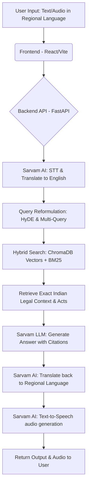

# Samvidhan Assistant 🇮🇳

A robust, multilingual Retrieval-Augmented Generation (RAG) application designed to help citizens understand the Indian Constitution in their native languages. 

This project strictly adheres to professional standards of **Type Safety, Performance, Error Handling, and Maintainability**. It leverages Sarvam AI's sovereign API stack for accurate Indic translations and voice generation, paired with a highly scalable local ChromaDB vector database.

## 🏗 Architecture & Workflow



### The Multilingual RAG Pipeline
1. **Input:** User submits a query via text or audio in a regional language (e.g., Hindi, Gujarati).
2. **Translation/STT:** Sarvam AI transcribes audio (if provided) and translates the Indic query into English safely using their secure models.
3. **Semantic Hybrid Search:** The English query (enhanced via HyDE and Multi-Query) searches a locally hosted ChromaDB vector database (powered by `BAAI/bge-large-en-v1.5`) alongside a BM25 keyword index to retrieve exact constitutional clauses.
4. **Generation:** The Sarvam LLM generates a concise, accurate English answer based *only* on the retrieved legal context and cites the specific Acts.
5. **Back-Translation:** The English answer is translated back into the user's selected regional language.
6. **Voice Synthesis (Optional):** Sarvam converts the translated text into natural-sounding Indic audio.

## 🚀 Tech Stack

**Frontend (React Standards & UI)**
* React 19 + TypeScript (Strict Type Safety)
* Vite (Fast tooling)
* Tailwind CSS v4 (Zero-config styling)
* TanStack Query v5 (Optimized server state, caching, and request deduplication)

**Backend (Performance & Error Handling)**
* Python (Asynchronous FastAPI)
* Pydantic (Strict request/response validation)
* LangChain, ChromaDB & BM25 (Hybrid retrieval)
* HuggingFace `BAAI/bge-large-en-v1.5` (Top-tier open source local embeddings)

## ⚙️ Local Development Setup

### Prerequisites
* Node.js (v18+)
* Python 3.11 or 3.12 (Managed via `pyenv` recommended)
* A [Sarvam AI](https://sarvam.ai) API Key

### Backend Setup
1. Navigate to the backend directory:
   ```bash
   cd backend
   ```
2. Create a virtual environment:
   ```bash
   python -m venv .venv
   ```
3. Activate the virtual environment:
   ```bash
   source .venv/bin/activate # On Windows: .venv\Scripts\activate
   ```
4. Install the dependencies:
   ```bash
   pip install -r requirements.txt
   ```
5. Set up the environment variables:
    Create a .env file in the backend/ directory and add:
   ```bash
   SARVAM_API_KEY=your_api_key_here
   ```
6. Run the FastAPI server:
   ```bash
   uvicorn main:app --reload --host 0.0.0.0 --port 8000
   ```
   (Note: Before running the server, ensure you have generated the ChromaDB and BM25 indices by running `python build_db.py`).

### Frontend Setup
1. Navigate to the frontend directory:
   ```bash
   cd frontend
   ```
2. Install the dependencies:
   ```bash
   npm install
   ```
3. Run the development server:
   ```bash
   npm run dev
   ```
4. Access the application at `http://localhost:5173` .
